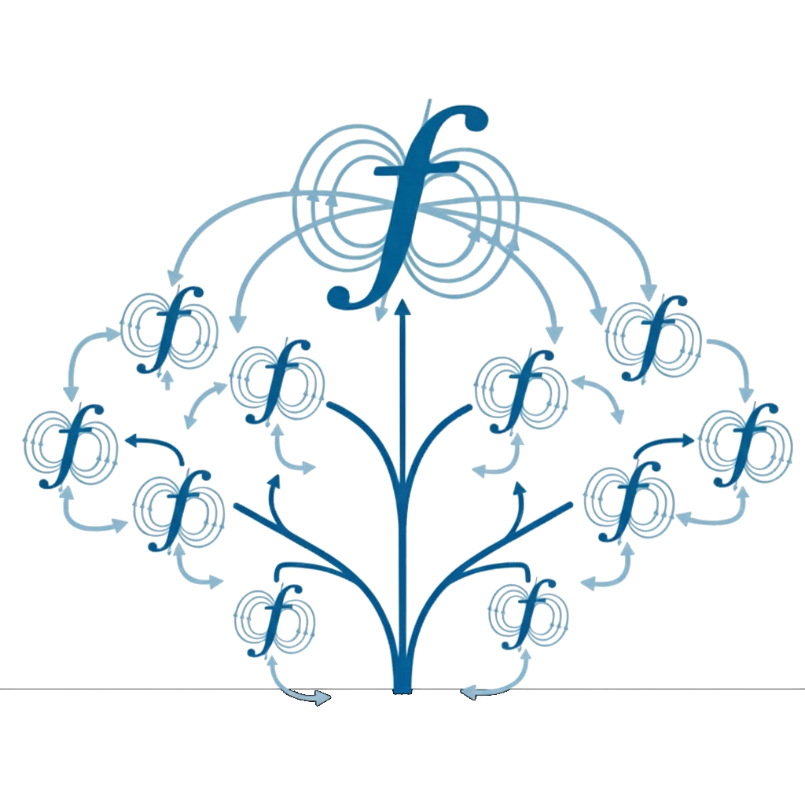

# Flux Hierarchy

> Create trees of Flux instances

[](https://badge.fury.io/py/flux-hierarchy)



This tool enables generation and orchestration of Flux hierarchies, or trees of instances.
Such a setup can enable programmatic organization and submission of commands, or high
throughput. Use cases we want to address:

- Creation (and organization) of a Flux Hierarchy
- Discovery of an existing Flux Hierarchy (e.g, for MCP)

## Usage

Let's first create a hierarchy. This will be a Flux job. You'll need to be in a Flux instance where a handle is discoverable. E.g., in the DevContainer:

```bash
flux start
```

Then create a simple, flat hierarchy with all the resources allocated to one broker.

```bash
flux-hierarchy start ./examples/hierarchy-one.yaml
```

You can test throughput (this also starts the hierarchy):

```bash
flux-hierarchy throughput ./examples/hierarchy-one.yaml
```

For either of the above, the hierarchy will continue running (and you need to cancel the job).

```bash
flux cancel $(flux job last)
```

## WIP

- Developing a more robust way to organize / discover handles.
- Then will test with throughput on more instances, etc.

## License

HPCIC DevTools is distributed under the terms of the MIT license.
All new contributions must be made under this license.

See [LICENSE](https://github.com/converged-computing/cloud-select/blob/main/LICENSE),
[COPYRIGHT](https://github.com/converged-computing/cloud-select/blob/main/COPYRIGHT), and
[NOTICE](https://github.com/converged-computing/cloud-select/blob/main/NOTICE) for details.

SPDX-License-Identifier: (MIT)

LLNL-CODE- 842614
